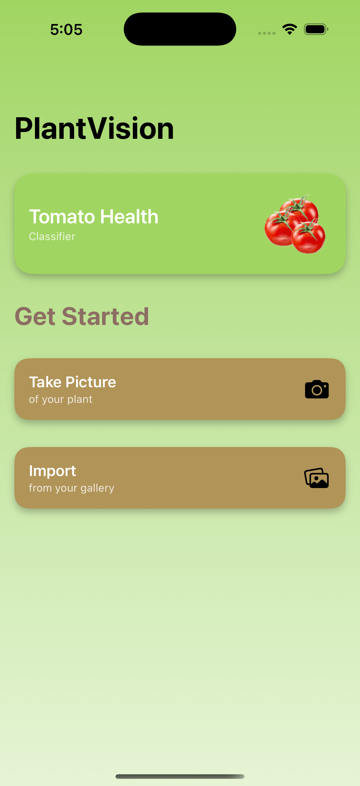
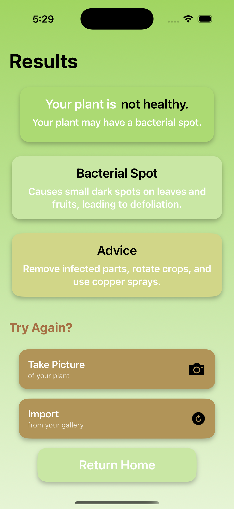
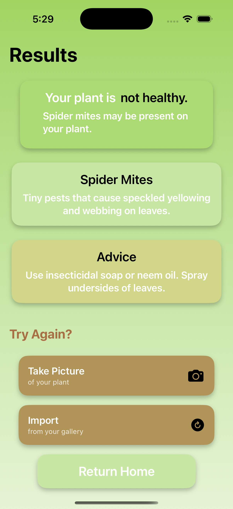
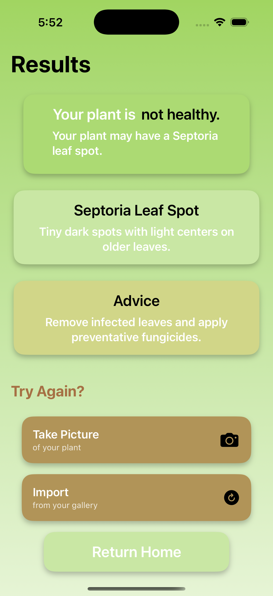

# 🌱 PlantVision


**PlantVision** is a full-stack mobile application that empowers users to diagnose the health of their tomato plants using machine learning. Users can take or upload a photo via a sleek Swift-based iOS frontend, which sends it to a FastAPI backend for real-time disease detection and care recommendations.

---

## 🚀 Features

- 📷 Upload or take a photo of a tomato plant leaf
- 🧠 ML-powered disease classification (95%+ accuracy)
- 💡 Tailored plant care recommendations
- 📱 Native SwiftUI frontend with intuitive UI
- 🔒 Secure API key authentication

---

## 🛠️ Tech Stack

| Layer        | Technology                      |
|--------------|----------------------------------|
| Frontend     | SwiftUI (iOS), PhotosPicker     |
| Backend      | FastAPI, Python, Uvicorn        |
| ML Model     | ImageNet V2 (fine-tuned)        |
| Deployment   | (Planned) AWS EC2 or Raspberry Pi |
| Security     | API key via environment variables |

---

## 🧠 ML Details

- Fine-tuned model based on ImageNet V2
- Trained on tomato plant disease dataset
- Accuracy: **95%+**
- Detects diseases like:
  - Bacterial Spot
  - Late Blight
  - Leaf Mold
  - Septoria Leaf Spot
  - And more…

---

## 📸 App Preview *(Demo Video Coming Soon)*
Here’s what the PlantVision app looks like:

<table>
  <tr>
    <th>Home Screen</th>
    <th>Bacterial Spot</th>
    <th>Spider Mites</th>
    <th>Septoria Leaf Spot</th>
  </tr>
  <tr>
    <td></td>
    <td></td>
    <td></td>
    <td></td>
  </tr>
</table>
---

## 🧪 To Do

What's next for PlantVision:

- 🧪 Add frontend tests for API/network handling  
- 🎨 Improve UI with error states and confidence scores  
- 🚀 Optional backend deployment (e.g. EC2, Pi, or Render)  
- 📦 Optimize app packaging and build settings  
- 📸 Add more screenshots and video demo  
- 🛠️ Polish README and documentation

---

## 🧰 Developer Setup

### Backend
```bash
# Clone and set up backend
cd PlantCoach/backend
python -m venv venv
source venv/bin/activate
pip install -r requirements.txt

# Add your API key
echo "API_KEY=your-secret-key" > .env

# Run the server
uvicorn main:app --reload

🧰 Developer Setup

Backend

# Clone and set up backend
cd PlantCoach/backend
python -m venv venv
source venv/bin/activate
pip install -r requirements.txt

# Add your API key
echo "API_KEY=your-secret-key" > .env

# Run the server
uvicorn main:app --reload

Frontend
	•	Open PlantCoach.xcodeproj in Xcode
	•	Add a Config.swift file containing your API key and URL (excluded from Git)

⸻

🔐 Security
	•	.env and Config.swift are excluded from Git
	•	Uses custom header AICoach-API-Key for authentication
	•	FastAPI handles API key validation securely

⸻

📚 Motivation

PlantCoach makes plant care easier and educational by:
	•	Encouraging beginner gardeners to learn biology
	•	Reducing plant disease uncertainty with real-time feedback
	•	Promoting homegrown produce and sustainable gardening

⸻

📄 License

MIT License. See LICENSE for details.
